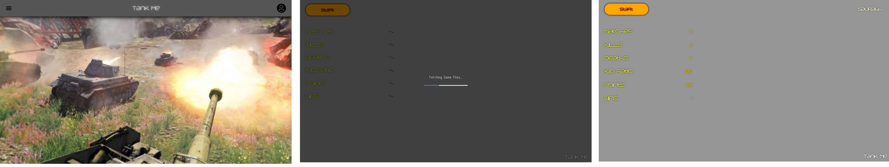
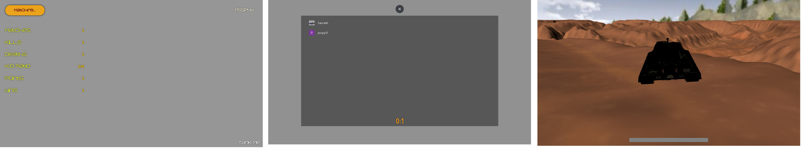
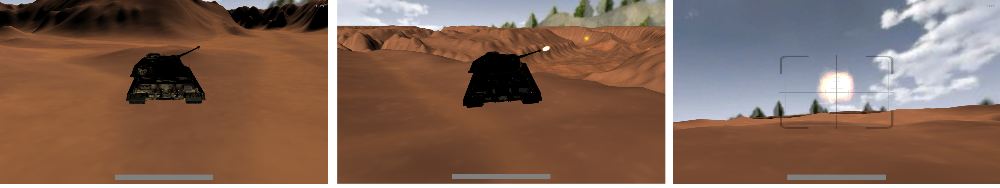
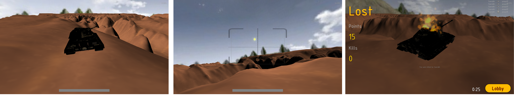
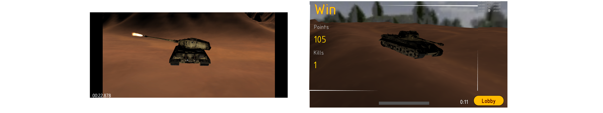

# tankme
An online 3D multiplayer tank game

Made using PeerJS, SocketIO and Babylon.js

Play the game [here](https://tank-me.herokuapp.com/)

* Matchmaking
* Play in rooms (currently 2 players per room)
* Peer to Peer data flow
* Match Stats
* Overall Stats
* Fun for long range battles

Controls :

*W - Forward
*A - Left
*S - Backward
*D - Right
*LeftArrow  - Turret Left  (Hold Ctrl for finer control)
*RightArrow - Turret Right (Hold Ctrl for finer control)
*T - Tank Reset (If you are upside-down)
*R - Turret Reset

